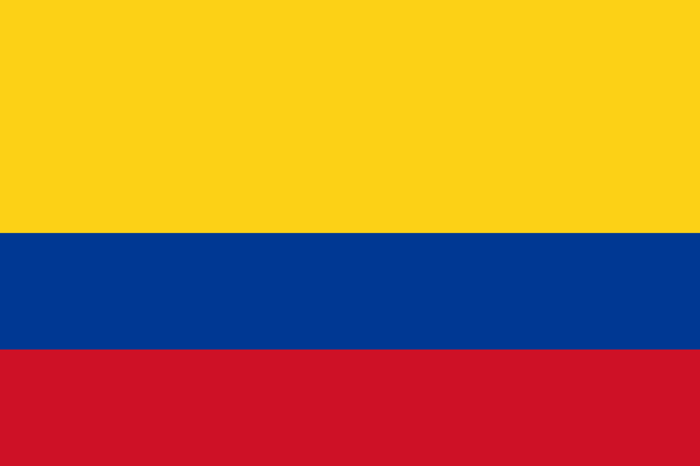
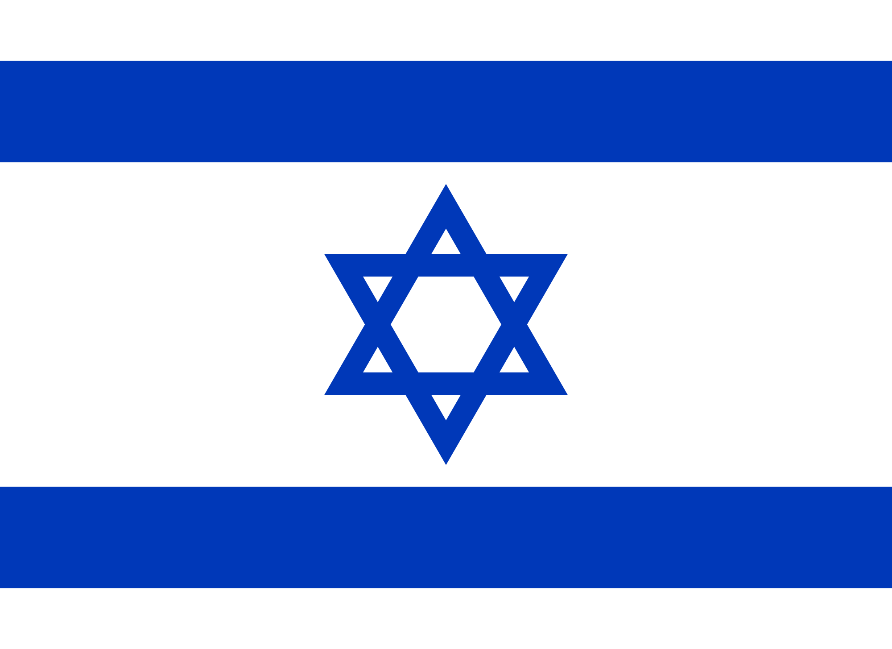

#UNION HACK - SUMMATIVE PRESENTATION

This project was about symbols and brands. To develop more our creativity on this specific sectors we were told to mash up four different flags or do four different variations of the same flag. I decided to do four variations of four different flags.

###BRAZILIAN FLAG

The first flag I decided to play with was the flag of Brazil. To be honest, this was the first time I ever played with a country flag in photoshop. I've done other things but never mash up a flag, so this was a challenge for me.

I wanted to mash up the flag but without the intention of making it an absolutely new flag. I wanted to keep the colours and the symbols but obviosuly I had to change something, so I decided to change the position of the colours and the place of the shapes or symbols. I'm going to start talking about the changes I did with the symbols. The blue circle with the white stars and the sentence "ORDEM E PROGRESSO" which means "ORDER AND PROGRESS" changed position with the yellow diamond. So the diamond gets the colours of the circle from the original flag. Now, the circle has the diamond in it unlike the original flag where the diamond twisted had the blue circle in it. The way I changed the colour background and the circle colour was basically giving to the circle the colour background from the original flag, so the background colour of my mashed up flag is yellow and the circle is green.

This was the first experiment of this project, I kind of like this flag but I know I could do better, I probably didn't choose the best flag to mash up but anyways I kept working on this projects and I came up with more flags.

###CANADIAN FLAG

The second flag I chose was the flag of Canada. I live in this country for five months so one of the first flags that came to my mind and that I thought I could mash up was the Canadian flag.

With the canadian flag I was trying to five a strong message more than designing and new flag for the country. This idea came from the fact that a couple of years ago before I went to Canada I read an article about teenagers from Canada being in the second place of the top teenagers of the world that consume marihuana. So I decided to give a message that shows the fact of marihuana being illegal something that shouldn't be good to do. When I presented this image to the class I came up with another idea from the feedback that my teachers and classmates gave me. Instead of making a _black X_ I could leave it without anything that covers the weed symbol or make it look like a jail. Here's the result:

I like more this flag than the first one with the _black X_ covering the weed symbol. I think this one makes it look more like something forbidden or something that you shouldn't do.

###COLOMBIAN FLAG

The third flag I decided to choose was the flag of the country where I was born, Colombia. I somehow wanted to add different colours to the flag that would represent things related to the country. I didn't think too much of adding symbols and stuff like that to the flag.

The changes I did were:

* Change the colour yellow from the original flag into a really bright and soft blue.
* Change the colour blue from the original flag into yellow.
* Change the colour red from the original flag into brown.
* Add a yellow circle where the colour yellow is in the mashed up flag.

The reason I did this is simple, the bright and soft blue represents the rivers and the sea in Colombia. It also represents that the sky is always clear without clouds in the majority of the cities in Colombia. The colour yellow that comes along with the yellow circle represent the sun. The weather of Colombia is quite nice and I tried to give that message and feeling with the colour yellow. The colour brown represents the coffee. Colombia is known as the best producer of coffe in the world. I think that we should everyone know so adding that colour to the flag is my way to do it. I really liked doing this flag because it's the flag of my country and trying to add to the flag the thoughts that I want people to have about my country was my way to mash up this flag.

###ISRAELI FLAG

As you can see, I've been choosing flags that are related to me somehow (I chose the Brazilian flag because that's where the last Football WorldCup was and that's where the Colombian football team did a great job). The reason I chose the flag of Israel is because that's where my parents met each other and because of that I wrote this text that you're reading right now.

I didn't make many changes in this flag. I just changed the colour blue into brown for the lines and the star in the middle. I also made the star without any white spaces as you can see. The reason I did this is because I wanted to represent that Israel is a country that is basically based on a desert and that's something that we all have to keep in mind because it's something that we should admire of this country. When the people from Israel first arrived to the land that we know as Israel today, they didn't have anything. They literally made a really advanced city from a desert when they didn't have much things to work with. That's why I used the colour brown in my Israeli flag. Now, the reason I chose to make the star without any white spaces is because the original star seems to be a bit broken and doesn't represent the union and the strength of this country. Making the star totally brown and with no holes and spaces, gives the feeling of being a stronger country.

###MY OWN FLAG

And here we've got the flag I created. It's got colours that are in the mash up I did for the Colombian flag. This flag is the flag of an imaginary city called "Braveland".

The blue represents the clear sky of this city and the rivers that are around Braveland. The yellow circle represents the sun that is always lighting the city, so it gives a message of that this is a city with a great weather, a city where rarely rains and never snows. The green represents the grass and the nature in this land. You can find any type of plants and animals, this is a kind of a technologic city but it's got big and well taken care forests. The tiger is the emblematic animal, it represents strength and courage.

This is the flag I created after mashing up four different flags from four different countries. I liked this project because this is something that I've never done before so it was a new experience for me.
